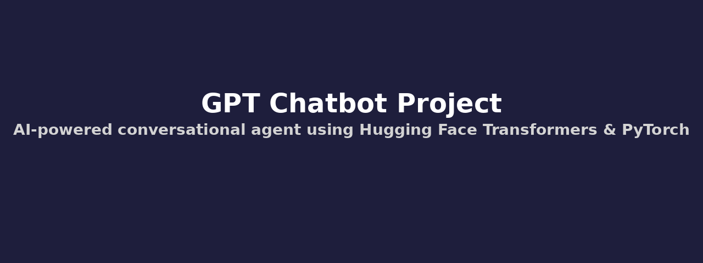

# 🧠 Text Generation Chatbot using Transformers

This project is a simple, terminal-based chatbot powered by **Hugging Face Transformers** (e.g., GPT-2, GPT-Neo, OPT) and **PyTorch**. It generates conversational responses to user input and can be used for experimentation, learning, or as a base for building more advanced AI assistants.

## 🚀 Features

- Supports multiple models:
  - GPT-2 (`gpt2`)
  - GPT-Neo (`EleutherAI/gpt-neo-1.3B`)
  - OPT (`facebook/opt-1.3b`)
- Generates creative, context-aware responses using language models.
- Includes an interactive CLI chatbot.
- Includes a test mode to evaluate with predefined queries.
- Can be extended to Streamlit for web UI or deployed on Hugging Face Spaces.
- Loads models securely (optionally supports Hugging Face token via `HUGGINGFACE_TOKEN` environment variable).

## 📦 Requirements

Install dependencies using:

```bash
pip install -r requirements.txt
```

**`requirements.txt`** includes:

```
torch>=1.13.0
transformers>=4.31.0
streamlit>=1.20.0
```

## 🧪 Running the Chatbot

To start the chatbot in your terminal:

```bash
python chatbot.py
```

Example interaction:

```
You: Hello!
Chatbot: Hello there! How can I assist you today?

You: Tell me a joke.
Chatbot: Why don't scientists trust atoms? Because they make up everything!

You: exit
Chatbot: Goodbye!
```

## 🧪 Running Test Cases

Run the test suite to see how the chatbot responds to various prompts:

```bash
python chatbot.py
```

(After the interactive chatbot, it will automatically run test cases.)

Example output:

```
Running chatbot test cases...
You: Tell me a joke.
Chatbot: Here's one... Why did the robot go on vacation? Because it needed a byte to eat!
...
```

## ⚙️ Model Selection

You can switch the default model by modifying:

```python
MODEL_NAME = AVAILABLE_MODELS["gpt2"]
```

Available options:

```python
AVAILABLE_MODELS = {
    "gpt2": "gpt2",
    "gpt-neo": "EleutherAI/gpt-neo-1.3B",
    "opt": "facebook/opt-1.3b"
}
```

## 🔐 Optional Hugging Face Token

If you're loading private models or using Hugging Face's API, you can set your token:

```bash
export HUGGINGFACE_TOKEN=your_token_here
```

Or store it in a `.env` file using `python-dotenv`.

## 📁 File Structure

```
├── chatbot.py           # Main chatbot script
├── requirements.txt     # Python dependencies
├── README.md            # Project documentation
```

## 💡 Future Improvements

- Add Streamlit/Gradio UI for a web-based chatbot.
- Enable speech-to-text and text-to-speech for voice interaction.
- Save conversation history to a file or database.
- Add memory/context retention across messages.

## 📜 License

This project is open-source under the **MIT License**.
